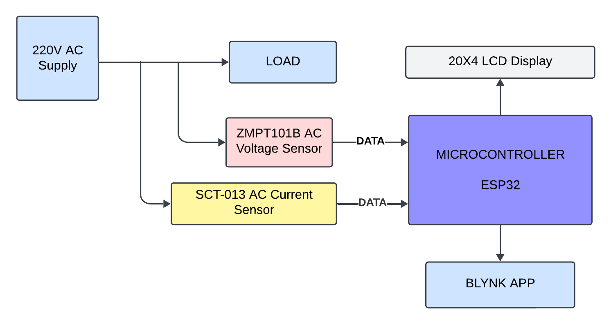

#  IoT-Based Smart Energy Meter  
### Using ESP32 · SCT-013 · ZMPT101B · Blynk 2.0

## 📘 Overview
This project is an **IoT-based Smart Energy Meter** built using an ESP32 microcontroller, SCT-013 current sensor, and ZMPT101B voltage sensor.  
It measures **voltage, current, power, energy (kWh), and power factor**, and uploads the data to **Blynk 2.0** for real-time cloud monitoring.

A local **20x4 I2C LCD** displays all readings, and **EEPROM** ensures energy data is saved even during power outages.

---

## 🚀 Features
- Real-time voltage and current measurement  
- Power, power factor, and energy calculation  
- IoT monitoring via Blynk (mobile + web)  
- Non-invasive sensors (safe AC measurement)  
- EEPROM-based energy retention  
- 20x4 LCD local display  
- Over-voltage alerts  
- Low cost & easily scalable  

---

## 🧩 Components Used
| Component | Specification |
|----------|--------------|
| ESP32 | Wi-Fi enabled microcontroller |
| SCT-013-030 | AC Current Sensor |
| ZMPT101B | AC Voltage Sensor |
| LCD | 20x4 I2C Display |
| Resistor | 10kΩ |
| Capacitor | 10µF |
| Platform | Blynk 2.0 |
| Power Supply | 5V USB |

---

## 📐 System Architecture
1. Sensors measure AC voltage and current  
2. ESP32 uses EmonLib to calculate RMS values  
3. Power, PF, and energy are computed  
4. LCD displays all values locally  
5. Blynk dashboard shows live data online  
6. EEPROM saves energy usage (kWh)

---

#   Circuit Diagram

## 🔄 Working Process
- Initialize WiFi, sensors, LCD, Blynk  
- Read stored energy from EEPROM  
- Measure voltage & current  
- Compute power and energy (kWh)  
- Display on LCD  
- Send to Blynk every cycle  
- Store kWh in EEPROM periodically

# Flow Chart

---

## 🧪 Results
- Stable real-time monitoring  
- Accurate RMS voltage/current  
- Reliable EEPROM storage  
- Suitable for home loads  

# Final Model

---

## 🔧 Optimizations
### Zero Crossing Power Factor
Lightweight and accurate method for calculating PF with minimal processing.

### EEPROM Optimization
Writes only when kWh changes → increases memory life.

---

## 📚 Applications
- Smart homes  
- Colleges & hostels  
- Energy analytics  
- Prepaid metering  
- Solar monitoring  

---

## 🔮 Future Enhancements
- Automated billing system  
- Load control via relays  
- Power theft detection  
- App notifications  
- Solar generation tracking  

---

## 📜 License
Open-source — free to modify and use.

---

## ⭐ Support
If you like this project, give it a ⭐ on GitHub!
